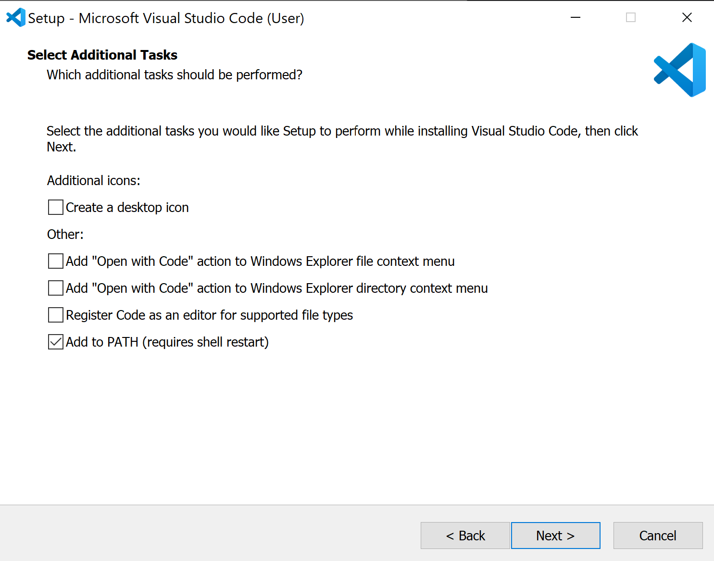
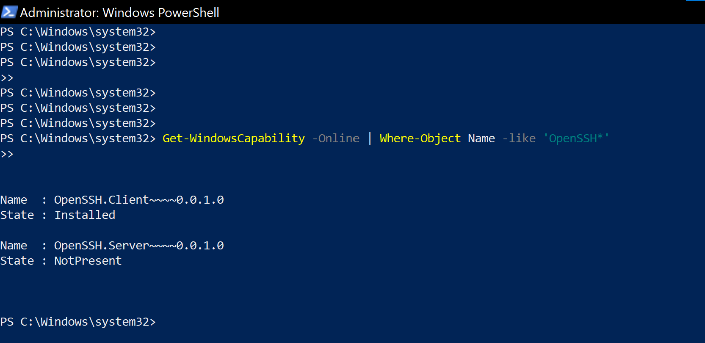
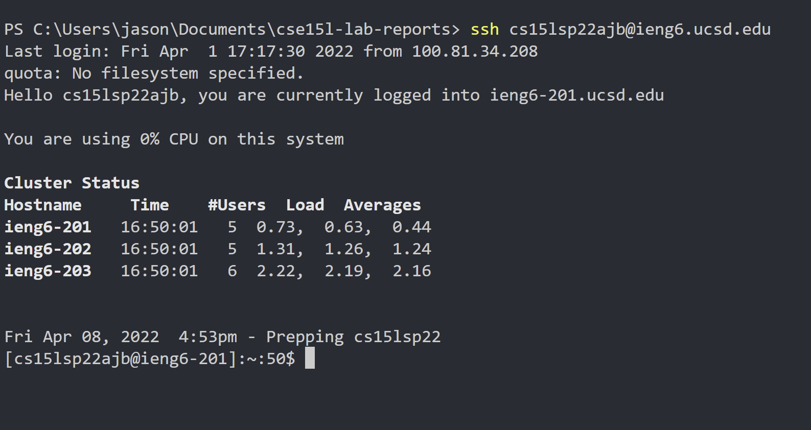

# CSE 12: Setting up Visual Studio Code

## 1. Download VScode for your operating system [VSCODE link](https://code.visualstudio.com/download) :arrow_left:
<p align="center">
    
</p>

## 2. Install VSCODE

<h3 align="center">Accept the License Agreement</h3>

<p align="center">
    
</p>

<h3 align="center">Select your preferences</h3>

<p align="center">
    
</p>

<h3 align="center">Final Install step</h3>

<p align="center">
    
</p>

<div class="center">
<p>The text within the div is centered horizontally.</p>
</div>

## 3. Install OpenSHH (Windows Guide)
### Open Power shell and enter command to check if Openssh is already installed
``` bat
Get-WindowsCapability -Online | Where-Object Name -like 'OpenSSH*'
```
<p align="center">
    
</p>

#### If Open SSH is not installed, install it with the following powershell command:

```
# Install the OpenSSH Client
Add-WindowsCapability -Online -Name OpenSSH.Client~~~~0.0.1.0

# Install the OpenSSH Server
Add-WindowsCapability -Online -Name OpenSSH.Server~~~~0.0.1.0
```


## 4. Connecting to Remote Server
>In VScode open a terminal in VSCode (Ctrl + `, or use the Terminal → New Terminal menu option).

<p align="center">
    
</p>
