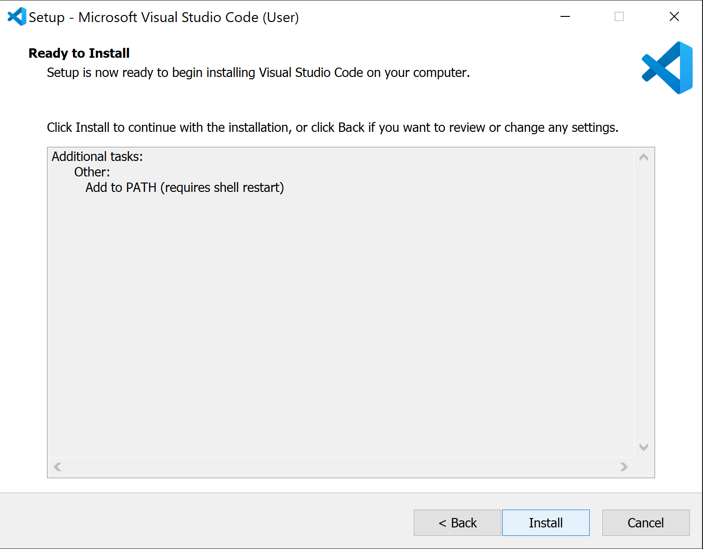

# CSE 12: Setting up Visual Studio Code

[LAB 1 instruction Link](https://docs.google.com/document/d/1AO6RDoJnaWxMui-UFjEa_2bbQ4qcANpbIpPuV-awsOg/edit#)

## 1. Download VScode for your operating system [VSCODE link](https://code.visualstudio.com/download) :arrow_left:
<p align="center">
    
</p>

## 2. Install VSCODE

<h3 align="center">Accept the License Agreement</h3>

<p align="center">
    
</p>

<h3 align="center">Select your preferences</h3>

<p align="center">
    
</p>

<h3 align="center">Final Install step</h3>

<p align="center">
    
</p>

<h3 align="center">Open Vscode</h3>

<p align="center">
    
</p>


## 3. Install OpenSHH (Windows Guide)
[Microsoft Guide](https://docs.microsoft.com/en-us/windows-server/administration/openssh/openssh_install_firstuse)

### Open Power shell and enter command to check if Openssh is already installed
``` bat
Get-WindowsCapability -Online | Where-Object Name -like 'OpenSSH*'
```
<p align="center">
    
</p>

#### If Open SSH is not installed, install it with the following powershell command:

``` bat
# Install the OpenSSH Client
Add-WindowsCapability -Online -Name OpenSSH.Client~~~~0.0.1.0

# Install the OpenSSH Server
Add-WindowsCapability -Online -Name OpenSSH.Server~~~~0.0.1.0
```


## 4. Connecting to Remote Server
1. **In VScode open a terminal in VSCode (Ctrl + `, or use the Terminal → New Terminal menu option).**

2. **Connect to the ieng6 server using ssh**
**Note: Replace cs15lsp22zz with your account name.**

``` bash
$ ssh cs15lsp22zz@ieng6.ucsd.edu
```
**When prompted enter you password. Your results should look simmilar to this**

```
⤇ ssh cs15lsp22zz@ieng6.ucsd.edu
The authenticity of host 'ieng6-202.ucsd.edu (128.54.70.227)' can't be established.
RSA key fingerprint is SHA256:ksruYwhnYH+sySHnHAtLUHngrPEyZTDl/1x99wUQcec.
Are you sure you want to continue connecting (yes/no/[fingerprint])? 
Password: 
Last login: Sun Jan  2 14:03:05 2022 from 107-217-10-235.lightspeed.sndgca.sbcglobal.net
quota: No filesystem specified.
Hello cs15lsp22zz, you are currently logged into ieng6-203.ucsd.edu

You are using 0% CPU on this system

Cluster Status 
Hostname     Time    #Users  Load  Averages  
ieng6-201   23:25:01   0  0.08,  0.17,  0.11
ieng6-202   23:25:01   1  0.09,  0.15,  0.11
ieng6-203   23:25:01   1  0.08,  0.15,  0.11

Sun Jan 02, 2022 11:28pm - Prepping cs15lsp22
```

## 5. Run some commands on the server
``` bash
cd ~
cd
ls -lat
ls -a
ls <directory> where <directory> is /home/linux/ieng6/cs15lsp22/cs15lsp22abc, where the abc is one of the other group members’ username
cp /home/linux/ieng6/cs15lsp22/public/hello.txt ~/
cat /home/linux/ieng6/cs15lsp22/public/hello.txt
```

### Screen shot of some commmands being run. 
<p align="center">
    
</p>


## 6. Moving Files with scp


### Create a file name WhereAmI.java in VSCode with the following code:

``` java
class WhereAmI {
  public static void main(String[] args) {
    System.out.println(System.getProperty("os.name"));
    System.out.println(System.getProperty("user.name"));
    System.out.println(System.getProperty("user.home"));
    System.out.println(System.getProperty("user.dir"));
  }
}
```
#### Run the code using javac and java in the terminal

```
PS C:\Users\jason\Documents\cse15l-lab-reports> javac .\WhereAmI.java
PS C:\Users\jason\Documents\cse15l-lab-reports> java WhereAmI
Windows 10
jason
C:\Users\jason
C:\Users\jason\Documents\cse15l-lab-reports
PS C:\Users\jason\Documents\cse15l-lab-reports> 
```

#### To copy the file to the server use the scp command
``` bash
scp WhereAmI.java cs15lsp22ajb@ieng6.ucsd.edu:~/
```
* Note. You should be prompted to enter you password
#### Your result should look simmilar to this
```
PS C:\Users\jason\Documents\cse15l-lab-reports> scp WhereAmI.java cs15lsp22ajb@ieng6.ucsd.edu:~/
WhereAmI.java                                                     100%  311     1.0KB/s   00:00  
```

#### SSH back into the server and run the `ls` command

* ##### You should see the file in your home directory

```
[cs15lsp22ajb@ieng6-201]:~:54$ ls
CSE12_PA1  WhereAmI.class  WhereAmI.java  perl5  test
```

## 7. Setting an SSH Key


## 8. Optimizing Remote Running

<div class="demo">
  <div class="perspective-container">
    <div class="card"></div>
  </div>
</div>


<style>
    .demo {
  background-color: hsl(207, 9%, 19%);
  display: flex;
  align-items: center;
  justify-content: center;
  height: 100vh;
  width: 100%;
}

.perspective-container {
  perspective: 800px;
}

.card {
  background-image: url(https://media.giphy.com/media/sIIhZliB2McAo/giphy.gif);
  background-size: cover;
  box-shadow: 0 0 140px 10px rgba(0,0,0,.5);
  position: relative;
  height: 300px;
  width: 500px;
  overflow: hidden; /* Try removing this to see how the sheen works! */
  --sheenX: 0; /* Set these with JavaScript */
  --sheenY: 0;
}
.card::after {
  content: "";
  position: absolute;
  top: -400px;
  right: -400px;
  bottom: -400px;
  left: -400px;
  background: linear-gradient(217deg, rgba(255,255,255,0), rgba(255,255,255,0) 35%, rgba(255,255,255,0.25) 45%, rgba(255,255,255,.25) 50%, rgba(255,255,255,0) 60%, rgba(255,255,255,0) 100%);
  transform: translateX(var(--sheenX)) translateY(var(--sheenY));
}

function handleMouseMove(event) {
  const height = window.innerHeight;
  const width = window.innerWidth;
  // Creates angles of (-20, -20) (left, bottom) and (20, 20) (right, top)
  const yAxisDegree = event.pageX / width * 40 - 20;
  const xAxisDegree = event.pageY / height * -1 * 40 + 20;
  target.style.transform = `rotateY(${yAxisDegree}deg) rotateX(${xAxisDegree}deg)`;
  // Set the sheen position
  setSheenPosition(event.pageX / width, event.pageY / width);
}

function setSheenPosition(xRatio, yRatio) {
  // This creates a "distance" up to 400px each direction to offset the sheen
  const xOffset = 1 - (xRatio - 0.5) * 800;
  const yOffset = 1 - (yRatio - 0.5) * 800;
  target.style.setProperty('--sheenX', `${xOffset}px`)
  target.style.setProperty('--sheenY', `${yOffset}px`)
}


</style>