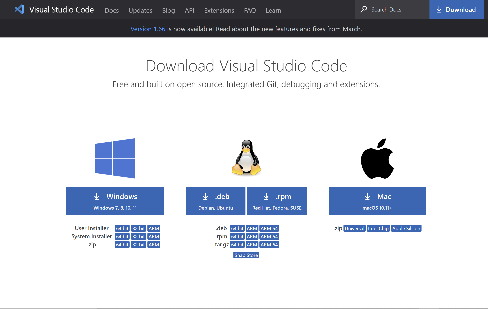

# CSE 12: Setting up Visual Studio Code

[LAB 1 instruction Link](https://docs.google.com/document/d/1AO6RDoJnaWxMui-UFjEa_2bbQ4qcANpbIpPuV-awsOg/edit#)

## 1. Download VScode for your operating system [VSCODE link](https://code.visualstudio.com/download) :arrow_left:
<p align="center">
    
</p>

## 2. Install VSCODE

<h3 align="center">Accept the License Agreement</h3>

<p align="center">
    
</p>

<h3 align="center">Select your preferences</h3>

<p align="center">
    
</p>

<h3 align="center">Final Install step</h3>

<p align="center">
    
</p>

<h3 align="center">Open Vscode</h3>

<p align="center">
    
</p>


## 3. Install OpenSHH (Windows Guide)
[Microsoft Guide](https://docs.microsoft.com/en-us/windows-server/administration/openssh/openssh_install_firstuse)

### Open Power shell and enter command to check if Openssh is already installed
``` bat
Get-WindowsCapability -Online | Where-Object Name -like 'OpenSSH*'
```
<p align="center">
    
</p>

#### If Open SSH is not installed, install it with the following powershell command:

``` bat
# Install the OpenSSH Client
Add-WindowsCapability -Online -Name OpenSSH.Client~~~~0.0.1.0

# Install the OpenSSH Server
Add-WindowsCapability -Online -Name OpenSSH.Server~~~~0.0.1.0
```


## 4. Connecting to Remote Server
1. **In VScode open a terminal in VSCode (Ctrl + `, or use the Terminal → New Terminal menu option).**

2. **Connect to the ieng6 server using ssh**
**Note: Replace cs15lsp22zz with your account name.**

``` bash
$ ssh cs15lsp22zz@ieng6.ucsd.edu
```
**When prompted enter you password. Your results should look simmilar to this**

```
⤇ ssh cs15lsp22zz@ieng6.ucsd.edu
The authenticity of host 'ieng6-202.ucsd.edu (128.54.70.227)' can't be established.
RSA key fingerprint is SHA256:ksruYwhnYH+sySHnHAtLUHngrPEyZTDl/1x99wUQcec.
Are you sure you want to continue connecting (yes/no/[fingerprint])? 
Password: 
Last login: Sun Jan  2 14:03:05 2022 from 107-217-10-235.lightspeed.sndgca.sbcglobal.net
quota: No filesystem specified.
Hello cs15lsp22zz, you are currently logged into ieng6-203.ucsd.edu

You are using 0% CPU on this system

Cluster Status 
Hostname     Time    #Users  Load  Averages  
ieng6-201   23:25:01   0  0.08,  0.17,  0.11
ieng6-202   23:25:01   1  0.09,  0.15,  0.11
ieng6-203   23:25:01   1  0.08,  0.15,  0.11

Sun Jan 02, 2022 11:28pm - Prepping cs15lsp22
```

## 5. Run some commands on the server
``` bash
cd ~
cd
ls -lat
ls -a
ls <directory> where <directory> is /home/linux/ieng6/cs15lsp22/cs15lsp22abc, where the abc is one of the other group members’ username
cp /home/linux/ieng6/cs15lsp22/public/hello.txt ~/
cat /home/linux/ieng6/cs15lsp22/public/hello.txt
```

### Screen shot of some commmands being run. 
<p align="center">
    
</p>


## 6. Moving Files with scp


### Create a file name WhereAmI.java in VSCode with the following code:

``` java
class WhereAmI {
  public static void main(String[] args) {
    System.out.println(System.getProperty("os.name"));
    System.out.println(System.getProperty("user.name"));
    System.out.println(System.getProperty("user.home"));
    System.out.println(System.getProperty("user.dir"));
  }
}
```
#### Run the code using javac and java in the terminal

```
PS C:\Users\jason\Documents\cse15l-lab-reports> javac .\WhereAmI.java
PS C:\Users\jason\Documents\cse15l-lab-reports> java WhereAmI
Windows 10
jason
C:\Users\jason
C:\Users\jason\Documents\cse15l-lab-reports
PS C:\Users\jason\Documents\cse15l-lab-reports> 
```

#### To copy the file to the server use the scp command
``` bash
scp WhereAmI.java cs15lsp22ajb@ieng6.ucsd.edu:~/
```
* Note. You should be prompted to enter you password
#### Your result should look simmilar to this
```
PS C:\Users\jason\Documents\cse15l-lab-reports> scp WhereAmI.java cs15lsp22ajb@ieng6.ucsd.edu:~/
WhereAmI.java                                                     100%  311     1.0KB/s   00:00  
```

#### SSH back into the server and run the `ls` command

* ##### You should see the file in your home directory

```
[cs15lsp22ajb@ieng6-201]:~:54$ ls
CSE12_PA1  WhereAmI.class  WhereAmI.java  perl5  test
```

## 7. Setting an SSH Key


## 8. Optimizing Remote Running

<div class="letter-image">
  <div class="animated-mail">
    <div class="back-fold"></div>
    <div class="letter">
      <div class="letter-border"></div>
      <div class="letter-title"></div>
      <div class="letter-context"></div>
      <div class="letter-stamp">
        <div class="letter-stamp-inner"></div>
      </div>
    </div>
    <div class="top-fold"></div>
    <div class="body"></div>
    <div class="left-fold"></div>
  </div>
  <div class="shadow"></div>
</div>


<style> 
body {
  background: #323641;
}

.letter-image {
  position: absolute;
  top: 50%;
  left: 50%;
  width: 200px;
  height: 200px;
  -webkit-transform: translate(-50%, -50%);
  -moz-transform: translate(-50%, -50%);
  transform: translate(-50%, -50%);
  cursor: pointer;
}

.animated-mail {
  position: absolute;
  height: 150px;
  width: 200px;
  -webkit-transition: .4s;
  -moz-transition: .4s;
  transition: .4s;
  
  .body {
    position: absolute;
    bottom: 0;
    width: 0;
    height: 0;
    border-style: solid;
    border-width: 0 0 100px 200px;
    border-color: transparent transparent #e95f55 transparent;
    z-index: 2;
  }
  
  .top-fold {
    position: absolute;
    top: 50px;
    width: 0;
    height: 0;
    border-style: solid;
    border-width: 50px 100px 0 100px;
    -webkit-transform-origin: 50% 0%;
    -webkit-transition: transform .4s .4s, z-index .2s .4s;
    -moz-transform-origin: 50% 0%;
    -moz-transition: transform .4s .4s, z-index .2s .4s;
    transform-origin: 50% 0%;
    transition: transform .4s .4s, z-index .2s .4s;
    border-color: #cf4a43 transparent transparent transparent;
    z-index: 2;
  }
  
  .back-fold {
    position: absolute;
    bottom: 0;
    width: 200px;
    height: 100px;
    background: #cf4a43;
    z-index: 0;
  }
  
  .left-fold {
    position: absolute;
    bottom: 0;
    width: 0;
    height: 0;
    border-style: solid;
    border-width: 50px 0 50px 100px;
    border-color: transparent transparent transparent #e15349;
    z-index: 2;
  }
  
  .letter {
    left: 20px;
    bottom: 0px;
    position: absolute;
    width: 160px;
    height: 60px;
    background: white;
    z-index: 1;
    overflow: hidden;
    -webkit-transition: .4s .2s;
    -moz-transition: .4s .2s;
    transition: .4s .2s;
    
    .letter-border {
      height: 10px;
      width: 100%;
      background: repeating-linear-gradient(
        -45deg,
        #cb5a5e,
        #cb5a5e 8px,
        transparent 8px,
        transparent 18px
      );
    }
    
    .letter-title {
      margin-top: 10px;
      margin-left: 5px;
      height: 10px;
      width: 40%;
      background: #cb5a5e;
    }
    .letter-context {
      margin-top: 10px;
      margin-left: 5px;
      height: 10px;
      width: 20%;
      background: #cb5a5e;
    }
    
    .letter-stamp {
      margin-top: 30px;
      margin-left: 120px;
      border-radius: 100%;
      height: 30px;
      width: 30px;
      background: #cb5a5e;
      opacity: 0.3;
    }
  }
}

.shadow {
  position: absolute;
  top: 200px;
  left: 50%;
  width: 400px;
  height: 30px;
  transition: .4s;
  transform: translateX(-50%);
  -webkit-transition: .4s;
  -webkit-transform: translateX(-50%);
  -moz-transition: .4s;
  -moz-transform: translateX(-50%);
  
  border-radius: 100%;
  background: radial-gradient(rgba(0,0,0,0.5), rgba(0,0,0,0.0), rgba(0,0,0,0.0));
}

  .letter-image:hover {
    .animated-mail {
      transform: translateY(50px);
      -webkit-transform: translateY(50px);
      -moz-transform: translateY(50px);
    }
    
    .animated-mail .top-fold {
      transition: transform .4s, z-index .2s;
      transform: rotateX(180deg);
      -webkit-transition: transform .4s, z-index .2s;
      -webkit-transform: rotateX(180deg);
      -moz-transition: transform .4s, z-index .2s;
      -moz-transform: rotateX(180deg);
      z-index: 0;
    }
    
    .animated-mail .letter {
      height: 180px;
    }
    
    .shadow {
      width: 250px;
    }
  }
</style>