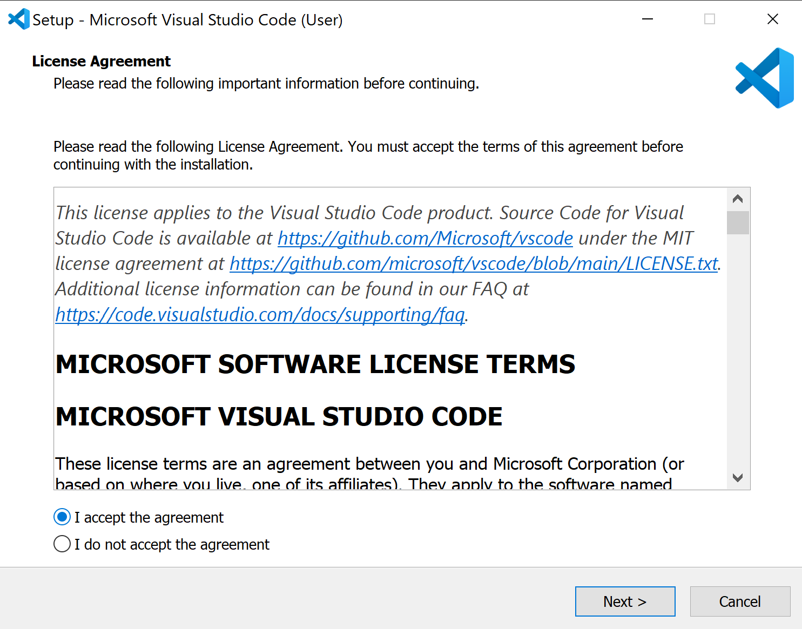

# CSE 12: Setting up Visual Studio Code

[LAB 1 instruction Link](https://docs.google.com/document/d/1AO6RDoJnaWxMui-UFjEa_2bbQ4qcANpbIpPuV-awsOg/edit#)

## 1. Download VScode for your operating system [VSCODE link](https://code.visualstudio.com/download) :arrow_left:
<p align="center">
    
</p>

## 2. Install VSCODE

<h3 align="center">Accept the License Agreement</h3>

<p align="center">
    
</p>

<h3 align="center">Select your preferences</h3>

<p align="center">
    
</p>

<h3 align="center">Final Install step</h3>

<p align="center">
    
</p>

<h3 align="center">Open Vscode</h3>

<p align="center">
    
</p>


## 3. Install OpenSHH (Windows Guide)
### Open Power shell and enter command to check if Openssh is already installed
``` bat
Get-WindowsCapability -Online | Where-Object Name -like 'OpenSSH*'
```
<p align="center">
    
</p>

#### If Open SSH is not installed, install it with the following powershell command:

``` cmd
# Install the OpenSSH Client
Add-WindowsCapability -Online -Name OpenSSH.Client~~~~0.0.1.0

# Install the OpenSSH Server
Add-WindowsCapability -Online -Name OpenSSH.Server~~~~0.0.1.0
```


## 4. Connecting to Remote Server
> #### In VScode open a terminal in VSCode (Ctrl + `, or use the Terminal → New Terminal menu option).

#### Connect to the ieng6 server using ssh
> #### Note: Replace cs15lsp22zz with your account name.

``` bash
$ ssh cs15lsp22zz@ieng6.ucsd.edu
```

<p align="center">
    
</p>

#### Enter your password when prompted