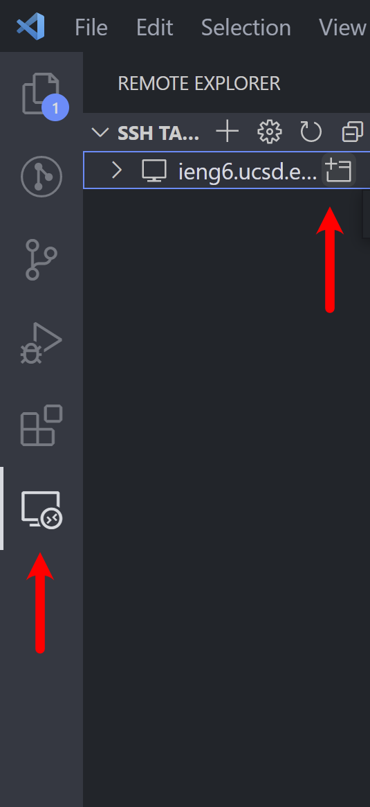

# CSE 12: Setting up Visual Studio Code

[LAB 1 instruction Link](https://docs.google.com/document/d/1AO6RDoJnaWxMui-UFjEa_2bbQ4qcANpbIpPuV-awsOg/edit#)

[The Forbidden Link](https://www.youtube.com/watch?v=dQw4w9WgXcQ)

## 1. Download VScode for your operating system [VSCODE link](https://code.visualstudio.com/download) :arrow_left:
<p align="center">
    
</p>

## 2. Install VSCODE

<h3 align="center">Accept the License Agreement</h3>

<p align="center">
    
</p>

<h3 align="center">Select your preferences</h3>

<p align="center">
    
</p>

<h3 align="center">Final Install step</h3>

<p align="center">
    
</p>

<h3 align="center">Open Vscode</h3>

<p align="center">
    
</p>


## 3. Install OpenSHH (Windows Guide)
[Microsoft Guide](https://docs.microsoft.com/en-us/windows-server/administration/openssh/openssh_install_firstuse)

### Open Power shell and enter command to check if Openssh is already installed
``` bat
Get-WindowsCapability -Online | Where-Object Name -like 'OpenSSH*'
```
<p align="center">
    
</p>

#### If Open SSH is not installed, install it with the following powershell command:

``` bat
# Install the OpenSSH Client
Add-WindowsCapability -Online -Name OpenSSH.Client~~~~0.0.1.0

# Install the OpenSSH Server
Add-WindowsCapability -Online -Name OpenSSH.Server~~~~0.0.1.0
```


## 4. Connecting to Remote Server :computer:
1. **In VScode open a terminal in VSCode (Ctrl + `, or use the Terminal → New Terminal menu option).**

2. **Connect to the ieng6 server using ssh**
**Note: Replace cs15lsp22zz with your account name.**

``` bash
$ ssh cs15lsp22zz@ieng6.ucsd.edu
```
**When prompted enter you password. Your results should look simmilar to this**

```
⤇ ssh cs15lsp22zz@ieng6.ucsd.edu
The authenticity of host 'ieng6-202.ucsd.edu (128.54.70.227)' can't be established.
RSA key fingerprint is SHA256:ksruYwhnYH+sySHnHAtLUHngrPEyZTDl/1x99wUQcec.
Are you sure you want to continue connecting (yes/no/[fingerprint])? 
Password: 
Last login: Sun Jan  2 14:03:05 2022 from 107-217-10-235.lightspeed.sndgca.sbcglobal.net
quota: No filesystem specified.
Hello cs15lsp22zz, you are currently logged into ieng6-203.ucsd.edu

You are using 0% CPU on this system

Cluster Status 
Hostname     Time    #Users  Load  Averages  
ieng6-201   23:25:01   0  0.08,  0.17,  0.11
ieng6-202   23:25:01   1  0.09,  0.15,  0.11
ieng6-203   23:25:01   1  0.08,  0.15,  0.11

Sun Jan 02, 2022 11:28pm - Prepping cs15lsp22
```

## 5. Run some commands on the server
``` bash
cd ~
cd
ls -lat
ls -a
ls <directory> where <directory> is /home/linux/ieng6/cs15lsp22/cs15lsp22abc, where the abc is one of the other group members’ username
cp /home/linux/ieng6/cs15lsp22/public/hello.txt ~/
cat /home/linux/ieng6/cs15lsp22/public/hello.txt
```

### Screen shot of some commmands being run. 
<p align="center">
    
</p>


## 6. Moving Files over SSH with scp


### Create a file name WhereAmI.java in VSCode with the following code:

``` java
class WhereAmI {
  public static void main(String[] args) {
    System.out.println(System.getProperty("os.name"));
    System.out.println(System.getProperty("user.name"));
    System.out.println(System.getProperty("user.home"));
    System.out.println(System.getProperty("user.dir"));
  }
}
```
#### Run the code using javac and java in the terminal

```
PS C:\Users\jason\Documents\cse15l-lab-reports> javac .\WhereAmI.java
PS C:\Users\jason\Documents\cse15l-lab-reports> java WhereAmI
Windows 10
jason
C:\Users\jason
C:\Users\jason\Documents\cse15l-lab-reports
PS C:\Users\jason\Documents\cse15l-lab-reports> 
```

#### To copy the file to the server use the scp command
``` console
scp WhereAmI.java cs15lsp22ajb@ieng6.ucsd.edu:~/
```
* Note. You should be prompted to enter you password
#### Your result should look simmilar to this
```
PS C:\Users\jason\Documents\cse15l-lab-reports> scp WhereAmI.java cs15lsp22ajb@ieng6.ucsd.edu:~/
WhereAmI.java                                                     100%  311     1.0KB/s   00:00  
```

#### SSH back into the server and run the `ls` command

#### You should see the file in your home directory

```
[cs15lsp22ajb@ieng6-201]:~:54$ ls
CSE12_PA1  WhereAmI.class  WhereAmI.java  perl5  test
```
#### SSH back into the server and run javac and java

```
PS C:\Users\jason\Documents\cse15l-lab-reports> ssh cs15lsp22ajb@ieng6.ucsd.edu
Last login: Mon Nov 29 17:33:04 2021 from 100.83.55.225
quota: No filesystem specified.
Hello cs15lsp22ajb, you are currently logged into ieng6-202.ucsd.edu

You are using 0% CPU on this system

Cluster Status 
Hostname     Time    #Users  Load  Averages
ieng6-201   13:20:01   11  0.45,  0.35,  0.23
ieng6-202   13:20:01   7   1.19,  1.12,  1.10
ieng6-203   13:20:01   7   2.42,  2.55,  2.64


Sat Apr 09, 2022  1:24pm - Prepping cs15lsp22
[cs15lsp22ajb@ieng6-202]:~:92$ javac WhereAmI.java
[cs15lsp22ajb@ieng6-202]:~:93$ java WhereAmI
Linux
cs15lsp22ajb
/home/linux/ieng6/cs15lsp22/cs15lsp22ajb
/home/linux/ieng6/cs15lsp22/cs15lsp22ajb
[cs15lsp22ajb@ieng6-202]:~:94$
```


## 7. Setting an SSH Key

#### Use ssh-keygen to create a pair of files, a public key and a private key.
On the client computer run `ssh-keygen` or `ssh-keygen -t ed25519` on windows. 

#### on client (your computer)
```
$ ssh-keygen
Generating public/private rsa key pair.
Enter file in which to save the key (/Users/<user-name>/.ssh/id_rsa): /Users/<user-name>/.ssh/id_rsa
Enter passphrase (empty for no passphrase): 
Note: Make sure that you do not add a passphrase for this step.
Enter same passphrase again: 
Your identification has been saved in /Users/<user-name>/.ssh/id_rsa.
Your public key has been saved in /Users/<user-name>/.ssh/id_rsa.pub.
The key fingerprint is:
SHA256:jZaZH6fI8E2I1D35hnvGeBePQ4ELOf2Ge+G0XknoXp0 <user-name>@<system>.local
The key's randomart image is:
+---[RSA 3072]----+
|                 |
|       . . + .   |
|      . . B o .  |
|     . . B * +.. |
|      o S = *.B. |
|       = = O.*.*+|
|        + * *.BE+|
|           +.+.o |
|             ..  |
+----[SHA256]-----+
```


## 8. Optimizing Remote Running

In VSCODE install Remote - SSH extensions


<p align="center">
    
</p>

#### In VS Code, select Remote-SSH: Add New SSH Host... from the Command Palette (F1, Ctrl+Shift+P)

<p align="center">
    
</p>

* When prompted enter the server adress `ssh cs15lsp22ajb@ieng6.ucsd.edu`

#### This will install VSCODE server on the UCSD server.
Once VSCODE server has finished intalling on the server go to the Remote Explorer tab on the left sidebar of VSCODE and click on
connect to host in new Window.

<p align="center">
    
</p>

### Now you can use VSCODE and your files and programs will be stored and remotly ran on the UCSD server.

<p align="center">
    
</p>
